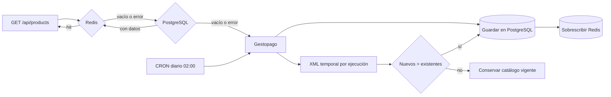

# Catálogo de productos Gestopago

Servicio Spring Boot que consulta y sincroniza el catálogo de Gestopago usando
PostgreSQL como almacenamiento permanente y Redis como caché de lectura.

## Arquitectura



Capas principales:

- `ProductCatalogController`: endpoint REST.
- `ProductCatalogServiceImpl`: orquestación Cache-Aside.
- `GestopagoProductGateway`: comunicación y clasificación de errores externos.
- `ProductDatabaseService`: lectura y reemplazo transaccional en PostgreSQL.
- `ProductCacheStore`: serialización JSON y operaciones de Redis.
- `ProductCatalogSyncScheduler`: sincronización diaria asíncrona.
- `ProductSnapshotFileService`: XML temporal en una carpeta única por ejecución.

## Flujo de consulta

`GET /api/products` aplica el siguiente orden:

1. Redis. Si contiene `gestopago:products:v1`, responde inmediatamente.
2. PostgreSQL. Si contiene productos, responde y vuelve a poblar Redis.
3. Gestopago. Deserializa el XML, guarda el catálogo en PostgreSQL, actualiza
   Redis y responde.

Una falla de Redis no interrumpe la consulta; activa el fallback a PostgreSQL.

Para evitar un *cache stampede*, cuando Redis está disponible pero la clave está
vacía solamente una solicitud reconstruye el caché. Las solicitudes concurrentes
esperan esa recarga y reutilizan el resultado. Si Redis está caído, PostgreSQL
continúa atendiendo concurrentemente. Gestopago aplica además un enfriamiento de
30 segundos después de una falla para no saturar al proveedor con reintentos.

## Sincronización diaria

El cron predeterminado es `0 0 2 * * *`, a las 02:00 de
`America/Mexico_City`. La ejecución utiliza un executor independiente y un
seguro local que evita dos sincronizaciones simultáneas.

La tarea:

1. Descarga el catálogo completo de Gestopago.
2. Crea una carpeta independiente bajo `./data/gestopago-sync`.
3. Serializa temporalmente la respuesta como `products.xml`.
4. Compara la cantidad de IDs únicos recibidos contra `COUNT(*)` en PostgreSQL.
5. Si viene vacío o la cantidad nueva es menor o igual, conserva PostgreSQL y Redis sin cambios.
6. Solo si la cantidad es mayor, reemplaza PostgreSQL dentro de una transacción.
7. Después del commit, sobrescribe Redis.
8. Elimina el archivo y la carpeta temporal en el bloque `finally`.

Los inserts JPA utilizan lotes de 100 registros.

## PostgreSQL

Flyway crea automáticamente la tabla `gestopago_products` mediante
`V3__create_gestopago_products.sql`. Para usar `Database-1`:

```powershell
$env:APP_DATABASE_ENABLED="true"
$env:SPRING_DATASOURCE_URL="jdbc:postgresql://localhost:5432/Database-1"
$env:SPRING_DATASOURCE_USERNAME="postgres"
$env:SPRING_DATASOURCE_PASSWORD="<contraseña-local>"
```

La contraseña no debe guardarse en `application.properties` ni versionarse.

## Redis

Redis Insight es únicamente una interfaz gráfica; también debe estar ejecutándose
el servidor Redis. Si todavía no existe el contenedor:

```powershell
docker run -d --name gestopago-redis -p 6379:6379 redis:7-alpine
```

Configuración predeterminada:

```properties
spring.data.redis.host=localhost
spring.data.redis.port=6379
product.cache.key=gestopago:products:v1
product.cache.ttl=26h
```

## Credenciales de Gestopago

```powershell
$env:PRODUCT_SERVICE_URL="https://gestopago.portalventas.net"
$env:PRODUCT_SERVICE_BEARER_TOKEN="<token-sin-la-palabra-Bearer>"
$env:PRODUCT_SERVICE_API_KEY="<api-key>"
```

El interceptor Feign agrega `Authorization: Bearer ...` y `X-API-Key`. Ningún
secreto se imprime en logs.

## Ejecución

En la misma consola donde se definieron las variables:

```powershell
.\gradlew.bat bootRun
```

Swagger: `http://localhost:8080/swagger-ui/index.html`

Endpoint principal: `GET http://localhost:8080/api/products`

## Autenticacion de la aplicacion movil

Flyway `V4__create_users_and_accounts.sql` crea las tablas `app_users` y
`accounts`. Cada usuario tiene exactamente una cuenta mediante una llave foranea
con borrado en cascada. Flyway `V5__create_user_sessions.sql` agrega la sesión
activa única de cada usuario.

Endpoints:

- `POST /api/auth/register`: valida el payload, rechaza correo o identificador
  repetido con HTTP `409` y crea usuario + cuenta dentro de una sola transaccion.
- `POST /api/auth/login`: valida el hash BCrypt y devuelve un JWT y el perfil del
  usuario. Las credenciales incorrectas devuelven HTTP `401` sin indicar cual
  campo fallo.

El login consulta PostgreSQL primero. Únicamente si PostgreSQL no está disponible,
intenta validar contra la copia protegida por BCrypt en Redis. Cada login reemplaza
la sesión anterior tanto en PostgreSQL como en Redis; por ello, un JWT anterior
deja de autorizar endpoints protegidos después de iniciar sesión nuevamente.

Ejemplo de registro:

```json
{
  "email": "marti@example.com",
  "identifier": "marti_01",
  "password": "Password1",
  "fullName": "Martin Perez"
}
```

Para desarrollo, si `AUTH_JWT_SECRET` esta vacio se crea una llave aleatoria al
iniciar la aplicacion. Para ejecuciones estables o produccion se debe configurar
un secreto aleatorio de al menos 32 caracteres en el archivo local ignorado por
Git o mediante variable de entorno:

```properties
auth.jwt.secret=un-secreto-aleatorio-de-al-menos-32-caracteres
```

El cliente se encuentra en `mobile/gestopago_app`. Incluye pantalla de login,
estado de carga, traduccion de errores HTTP y una tabla SQLite local para la
sesion. La contrasena nunca se persiste en el dispositivo.

## Errores JSON

| Código propio | HTTP | Significado |
|---:|---:|---|
| 1 | 502 | Gestopago está caído, rechazó la solicitud o hubo conexión/timeout. |
| 2 | 500 | Gestopago respondió, pero ocurrió un error de serialización o PostgreSQL. |

Todas las operaciones de Redis, PostgreSQL, archivos y Gestopago están protegidas
con `try-catch`. Una excepción imprevista del endpoint también se transforma en
JSON con código `2`, sin exponer trazas ni credenciales al cliente.

Ejemplo:

```json
{
  "timestamp": "2026-09-19T12:00:00Z",
  "code": 1,
  "message": "Error de conexión a internet o timeout al comunicarse con Gestopago",
  "path": "/api/products"
}
```

## Pruebas

```powershell
.\gradlew.bat clean test
```

Las pruebas cubren el orden Redis/PostgreSQL/Gestopago, fallas de Redis, error de
base de datos, servicio externo caído, timeout, XML inválido, mapeo XML, la regla
que impide reemplazar la base con un catálogo vacío, igual o menor y solicitudes concurrentes
sobre un caché vacío.
